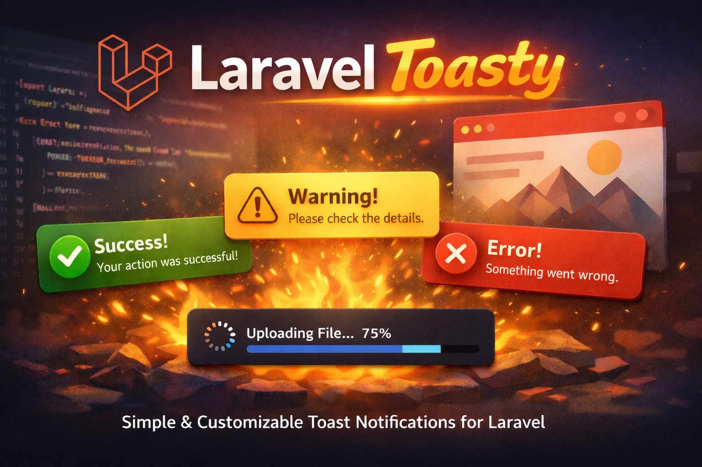

# Laravel Toasty

[](https://packagist.org/packages/atomcoder/laravel-toasty)
[](https://packagist.org/packages/atomcoder/laravel-toasty)
[](https://packagist.org/packages/atomcoder/laravel-toasty)
[](https://laravel.com)
[](LICENSE.md)
[](https://github.com/RichieMcMullen/laravel-toasty/releases)
[](https://github.com/RichieMcMullen/laravel-toasty/stargazers)



Collision-safe toast notifications for Laravel `10` through `13`.

Laravel Toasty works with:

- standard Laravel controllers and redirects
- Blade layouts
- Alpine
- Livewire
- plain browser JavaScript

The package uses namespaced APIs so it does not clash with Flux toasts or generic `toast()` helpers.

See [CHANGELOG.md](CHANGELOG.md) for release history.

## What You Get

- `<x-laravel-toasty::toasts />` Blade component
- `@laravelToasty` Blade directive
- `laravel_toasty()` helper
- `LaravelToasty` facade alias
- immediate Livewire support with `laravel_toasty($this)` or `LaravelToasty::for($this)`
- optional lower-level Livewire trait methods
- `window.LaravelToasty` JavaScript API
- bundled CSS inside the package, so Tailwind setup is not required

## Requirements

- PHP `8.1+`
- Laravel `10+`
- Alpine.js `3+`

Livewire is optional.

## Installation

Install with Composer:

```bash
composer require atomcoder/laravel-toasty
```

Publish the config if you want to change defaults:

```bash
php artisan vendor:publish --tag=laravel-toasty-config
```

Publish the views only if you want to override the package markup:

```bash
php artisan vendor:publish --tag=laravel-toasty-views
```

You do not need to:

- install Tailwind for this package
- add vendor Blade paths to Tailwind `content`
- import a separate package stylesheet

## Quick Start

### 1. Render the toast stack once

Add this near the end of your main layout, usually before `</body>`:

```blade
<x-laravel-toasty::toasts />
```

Or:

```blade
@laravelToasty
```

### 2. Make sure Alpine is loaded

If your app already has Alpine, you are done.

If not:

```blade
<script defer src="https://cdn.jsdelivr.net/npm/alpinejs@3.x.x/dist/cdn.min.js"></script>
```

### 3. Trigger a toast

Normal Laravel request:

```php
laravel_toasty()->success('Profile updated');
```

Livewire immediate toast:

```php
laravel_toasty($this)->success('Profile updated');
```

Browser JavaScript:

```html
<script>
    window.LaravelToasty.notify('Profile updated');
</script>
```

## How It Works

Laravel Toasty supports two main server-side flows:

### Session toast

Use this in controllers, middleware, or normal Laravel request code:

```php
laravel_toasty()->success('Saved');
```

That stores the toast in the session, and the next page render shows it.

### Immediate Livewire toast

Use this inside a Livewire component action:

```php
laravel_toasty($this)->success('Saved');
```

That dispatches a browser event immediately through the current component, so the user sees the toast without leaving the page.

## Main APIs

### Helper

```php
laravel_toasty()
laravel_toasty($this)
```

### Facade

```php
LaravelToasty::success('Saved');
LaravelToasty::for($this)->success('Saved');
```

### Blade

```blade
<x-laravel-toasty::toasts />
@laravelToasty
```

### JavaScript

```js
window.LaravelToasty.notify('Saved');
window.LaravelToasty.layout('expanded');
```

## Full Usage Examples

### Example 1: Standard controller redirect

Use this when the request ends with a redirect.

```php
<?php

namespace App\Http\Controllers;

use App\Http\Requests\ProfileRequest;

class ProfileController
{
    public function update(ProfileRequest $request)
    {
        $request->user()->update($request->validated());

        laravel_toasty()->success(
            'Profile updated',
            'Your account details were saved successfully.'
        );

        return redirect()->route('profile.edit');
    }
}
```

### Example 2: Controller with custom options

```php
public function destroy(Project $project)
{
    $project->delete();

    laravel_toasty()->danger(
        'Project deleted',
        'This action cannot be undone.',
        [
            'position' => 'bottom-right',
            'duration' => 6000,
            'layout' => 'expanded',
        ]
    );

    return redirect()->route('projects.index');
}
```

### Example 3: Facade usage

```php
<?php

namespace App\Http\Controllers;

use LaravelToasty;

class DashboardController
{
    public function __invoke()
    {
        LaravelToasty::info('Welcome back');

        return view('dashboard');
    }
}
```

### Example 4: Livewire with unified helper

This is the recommended Livewire API.

```php
<?php

namespace App\Livewire;

use Livewire\Component;

class EditProfile extends Component
{
    public string $name = '';

    public function save(): void
    {
        auth()->user()->update([
            'name' => $this->name,
        ]);

        laravel_toasty($this)->success(
            'Profile updated',
            'Your changes were saved immediately.',
            ['position' => 'top-right']
        );
    }

    public function render()
    {
        return view('livewire.edit-profile');
    }
}
```

### Example 5: Livewire with facade

```php
<?php

namespace App\Livewire;

use Livewire\Component;
use LaravelToasty;

class BillingForm extends Component
{
    public function save(): void
    {
        LaravelToasty::for($this)->info(
            'Billing details updated',
            'Your payment information is now current.'
        );
    }
}
```

### Example 6: Livewire redirect

If your Livewire action redirects away, use the normal session helper:

```php
public function createWorkspace()
{
    $workspace = auth()->user()->workspaces()->create([
        'name' => $this->name,
    ]);

    laravel_toasty()->success(
        'Workspace created',
        'You have been taken to your new workspace.'
    );

    return $this->redirect(route('workspaces.show', $workspace));
}
```

### Example 7: Livewire trait alternative

If you prefer dedicated Livewire-specific methods, the trait still works:

```php
<?php

namespace App\Livewire;

use Livewire\Component;
use Atomcoder\Toasty\Concerns\InteractsWithToasts;

class EditAccount extends Component
{
    use InteractsWithToasts;

    public function save(): void
    {
        $this->dispatchLaravelToastySuccess(
            'Account updated',
            'Your settings were saved.'
        );
    }
}
```

### Example 8: Blade and Alpine button

```blade
<button
    type="button"
    x-on:click="window.LaravelToasty.notify('Saved from Alpine', {
        type: 'success',
        description: 'The client-side action completed.',
        position: 'bottom-right'
    })"
>
    Save
</button>
```

### Example 9: Plain JavaScript

```html
<script>
    window.LaravelToasty.notify('Deployment complete', {
        type: 'success',
        description: 'Everything is live.',
        position: 'top-right',
        duration: 5000,
    });
</script>
```

### Example 10: HTML toast

Only use trusted HTML.

```php
laravel_toasty()->html(<<<'HTML'
    <div style="padding: 1rem;">
        <strong>Deployment complete</strong>
        <div style="margin-top: .5rem; opacity: .8;">
            Version 2.0.0 is now live.
        </div>
    </div>
HTML, [
    'position' => 'bottom-right',
    'duration' => 10000,
]);
```

### Example 11: Multiple toasts in one request

```php
laravel_toasty()->success('Project created');
laravel_toasty()->info('Invite your team');
laravel_toasty()->warning('Remember to configure billing');
```

### Example 12: Inspecting and clearing queued session toasts

This only works with the session queue, not the already-mounted browser stack.

```php
$toasts = laravel_toasty()->all();

if (count($toasts) > 5) {
    laravel_toasty()->clear();
}
```

## Available Methods

These methods are available through `laravel_toasty()`, `laravel_toasty($this)`, and `LaravelToasty::for(...)`:

- `flash($message, $options = [])`
- `success($message, $description = null, $options = [])`
- `info($message, $description = null, $options = [])`
- `warning($message, $description = null, $options = [])`
- `danger($message, $description = null, $options = [])`
- `like($message, $description = null, $options = [])`
- `bell($message, $description = null, $options = [])`
- `html($html, $options = [])`

These methods are only useful for the session-backed queue:

- `all()`
- `clear()`

## Toast Options

Every toast accepts these options:

| Option | Type | Description |
| --- | --- | --- |
| `description` | `string|null` | Secondary line under the title |
| `type` | `default`, `success`, `info`, `warning`, `danger`, `like`, `bell` | Visual style and icon |
| `position` | `top-left`, `top-center`, `top-right`, `bottom-left`, `bottom-center`, `bottom-right` | Stack location |
| `duration` | `int` | Auto-dismiss time in milliseconds. Use `0` to keep it open |
| `closeable` | `bool` | Whether the close button is shown |
| `layout` | `default`, `expanded` | Stack layout mode |
| `html` | `string|null` | Trusted custom HTML |

## JavaScript API

The package registers:

```js
window.LaravelToasty
window.laravelToasty
```

Available methods:

- `window.LaravelToasty.notify(message, options = {})`
- `window.LaravelToasty.toast(message, options = {})`
- `window.LaravelToasty.layout(layout = 'expanded', eventName = null)`
- `window.LaravelToasty.setLayout(layout = 'expanded', eventName = null)`

Example:

```html
<script>
    window.LaravelToasty.notify('Warning', {
        type: 'warning',
        description: 'Storage is almost full.',
        duration: 0,
        closeable: true,
    });

    window.LaravelToasty.layout('expanded');
</script>
```

## Blade Component Props

You can override defaults directly on the component:

```blade
<x-laravel-toasty::toasts
    position="bottom-right"
    layout="expanded"
    :duration="7000"
    :padding-between-toasts="20"
    :closeable="false"
    :z-index="120"
    theme="toasty"
/>
```

Useful props:

- `position`
- `layout`
- `duration`
- `padding-between-toasts`
- `event-name`
- `layout-event-name`
- `closeable`
- `z-index`
- `theme`
- `styles`
- `legacy-aliases`

## Configuration

Publish the config:

```bash
php artisan vendor:publish --tag=laravel-toasty-config
```

This creates:

```php
config/laravel_toasty.php
```

Main config keys:

- `event_name`
- `layout_event_name`
- `session_key`
- `legacy_aliases`
- `position`
- `layout`
- `duration`
- `padding_between`
- `closeable`
- `z_index`
- `theme`
- `themes`
- `styles`

Example:

```php
return [
    'event_name' => 'laravel-toasty:notify',
    'layout_event_name' => 'laravel-toasty:layout',
    'session_key' => 'laravel_toasty.toasts',
    'legacy_aliases' => false,

    'position' => 'top-center',
    'layout' => 'default',
    'duration' => 4000,
    'padding_between' => 15,
    'closeable' => true,
    'z_index' => 99,

    'theme' => 'pines',
    'styles' => [],
];
```

## Themes

Built-in themes:

- `pines`
- `toasty`
- `glass`

Change the theme:

```php
'theme' => 'toasty',
```

Override part of a theme:

```php
'styles' => [
    'max_width' => '30rem',
    'base' => [
        'radius' => '1.25rem',
    ],
    'types' => [
        'success' => [
            'background' => 'linear-gradient(135deg, #166534, #14532d)',
        ],
    ],
],
```

You can also pass `styles` directly to the Blade component for per-page overrides.

## Customizing the View

Publish the views:

```bash
php artisan vendor:publish --tag=laravel-toasty-views
```

Published path:

```text
resources/views/vendor/laravel-toasty/components/toasts.blade.php
```

Important: published vendor views override future package view updates until you remove or update them yourself.

## Migration From Older Versions

If you are upgrading from the older generic naming:

| Old | New |
| --- | --- |
| `toasty()` | `laravel_toasty()` |
| `@toasty` | `@laravelToasty` |
| `<x-toasty::toasts />` | `<x-laravel-toasty::toasts />` |
| `window.Toasty` | `window.LaravelToasty` |
| `window.toast(...)` | `window.LaravelToasty.notify(...)` |

If needed, you can temporarily enable:

```php
'legacy_aliases' => true,
```

## Troubleshooting

### Toasts do not show at all

Check:

- Alpine is loaded
- the stack is rendered once in your layout
- your layout includes `<x-laravel-toasty::toasts />`

### Livewire action runs but no toast appears

If you stay on the same page, use:

```php
laravel_toasty($this)->success('Saved');
```

or:

```php
LaravelToasty::for($this)->success('Saved');
```

If you redirect away, use:

```php
laravel_toasty()->success('Saved');
```

### You still see old markup or old errors after updating

Look for stale published views:

```bash
rg -n "window\\.LaravelToastyComponent|window\\.ToastyComponent" resources/views vendor
```

Then clear caches:

```bash
php artisan optimize:clear
composer clear-cache
```

### `all()` and `clear()` do not affect Livewire toasts already visible on screen

That is expected. They only work with the server-side session queue.

### Queue jobs or background jobs

Untargeted helper calls are session-backed, so they are meant for the web request lifecycle, not queue workers.

## Testing

Run the package tests with:

```bash
composer test
```

## Credits

- [DevDojo Pines Toast](https://devdojo.com/pines/docs/toast) for the original interaction inspiration

## License

MIT
